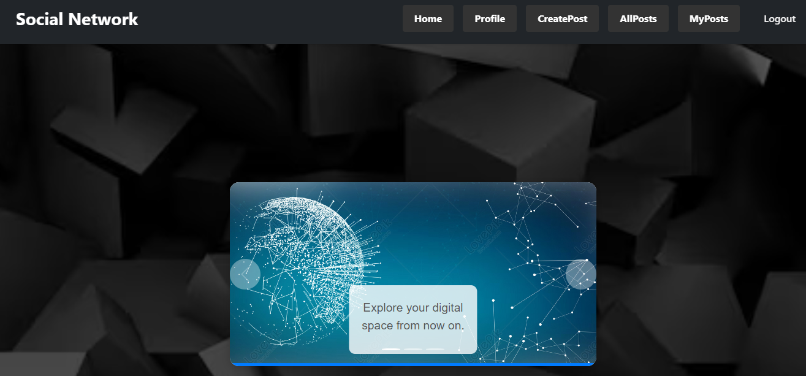

# Frontend Social Network :earth_africa:

Explore My SocialNetwork Frontend Creation – Enjoy the Experience! :dizzy:
<br><br>

</a>

<details>
  <summary>Table of Contents :file_folder:</summary>
  <ol>
 <li><a href="#description">Description</a></li>
    <li><a href="#objetive">Objetive</a></li>
    <li><a href="#stack">Stack</a></li>
    <li><a href="#local-installation">Local installation</a></li>
    <li><a href="#views">Views</a></li>
    <li><a href="#future-functionalities️">Future functionalities</a></li>
    <li><a href="#development">Development</a></li>
    <li><a href="#appreciations">Appreciations</a></li>
    <li><a href="#contact">Contact</a></li>
  </ol>
</details>
<br>

## Description :page_with_curl:
This project aims to develop the interface of a new social platform, which will connect with our API in charge of managing the business functionalities. Through this development, users will be able to register, log in, customise their profile, and communicate with other members through posts. In addition, they will have access to a variety of content and will be able to explore the most prominent trends within the community.

The project also encompasses the creation of an administration panel, from where they will be able to control the platform's information, monitor user behaviour, and perform moderation tasks to ensure a safe and attractive environment for all participants.
<br><br>
<p align="center">

</p>

## Objetive :checkered_flag:
The goal of this project is to design and develop a front-end interface for the application that is versatile enough to be accessed and used efficiently by clients, professionals and administrators alike. To achieve this, I am using React, a framework that allows to build dynamic and scalable interfaces. As I progress on the project, I continue to hone my React skills, making sure that the interface is not only functional, but also intuitive and easy to navigate for all users involved.

## Stack :space_invader:
<div align="center">
<a>
    
</a>
<a>
    
</a>
<a>
    
</a>
<a>
    
</a>
<a>

</a>
<a>
    
</a>
<a>
    
</a>
<a>
    
</a>
<a>
    
</a>
<a>
    
</a>
</div>

## Local installation :computer:

### Frontend :art:

1. Clone the repository
2. ``` $ npm install  ```
3. ``` $ npm run dev ```

### Backend :hammer:

1. Install docker and create a MySQL container
2. Clone the repository
3. ``` $ npm install  ```
4. ``` $ npm db:refresh ```
5. ``` $ npm run dev ```


## Views :camera:

### Home :japanese_castle:


### Login and Register :unlock:


### Profile :dizzy:


### Admin Dashboard :stars:


### Create Posts :performing_arts:


### My Posts :ticket:


### All Posts :envelope:


## Future functionalities :crystal_ball:
- Option to follow.
- Leave comments on posts.
- Data validation.


## Development :raising_hand:

```js
const developer = "SantiagoAlfaro"

console.log (Developed: "SantiagoAlfaro")
```

## Appreciations :triangular_flag_on_post:

I would like to express my gratitude to the Geeks Hubs teachers and my daily colleagues, with whom I collaborate and with whom we support each other in solving our problems.

## Contact :satellite:

**Santiago Juan Alfaro Martí**
  - [GitHub](https://github.com/SantiagoAlfaroMarti)